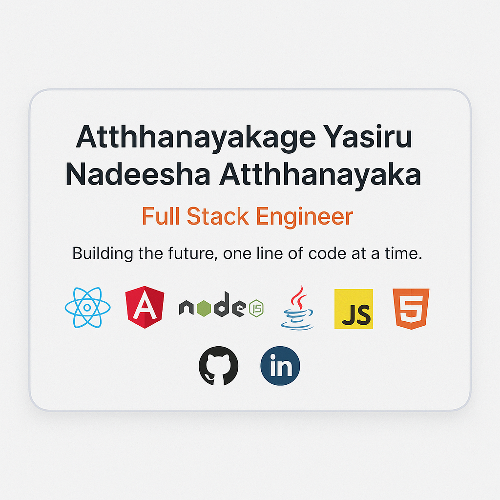

## Hi there 👋

<h1 align="center">Hi 👋, I'm A. Yasiru Nadeesha Aththanayaka . </h1>
<h3 align="center">A passionate DevOps Engineer from Sri Lanaka</h3>

<!-- Profile Views Counter with Badges -->

  
  
  
  

 
  <a href="https://github.com/ryo-ma/github-profile-trophy">
    <!---->
    
  </a>

  

<!--## Professional Summary

Software engineer with a focus on full-stack development, specializing in Java, Spring Boot, React, and Node.js. Experienced in building scalable applications with modern architectures. Currently developing a real-time event ticket booking system with high-concurrency support.-->

<!-- About Me Section -->
## 💫 About Me

<!---->

- 🔭 I'm currently working on health care application :- [HealthNexus](https://health-nexus.netlify.app/)

- 🌱 I'm currently learning **Machine Learning**

- 👯 I'm looking to collaborate on **open-source projects**

- 💬 Ask me about **Java, OOP, React, Spring Boot**

- 📫 How to reach me: **a.y.nadeeshaaththanayaka@gmail.com**

- 👨‍💻 All of my projects are available at [GitHub](https://github.com/yasirunadeeshaa?tab=repositories)

- 🌐 Visit my portfolio: [Coming Soon](#)

- ⚡ Fun fact: **The first programming language I learned was Java**
  
<!-- Skills Section -->

## 🛠️ Technical Skills

<b>Languages</b>

 

  
  
  
  
  
  
  

<b>Frameworks & Libraries</b>

 

  
  
  
  
  
  

<b>Databases & Tools</b>

 

  
  
  
  
  
  

 

<!-- GitHub Stats Section -->
## 📊 GitHub Stats

  
  

  

<!-- Featured Projects -->
## 🚀 Featured Projects

<!-- Add more project cards here as needed -->

  
<!-- Connect with me section -->
## 🌐 Connect with Me

  
  
  
  

  
<!-- Banner Image -->

  

Thank you for visiting my profile! Have a great day! 😊

<!-- Introduction with Typing Effect -->
<h1 align="center">
  
</h1>

